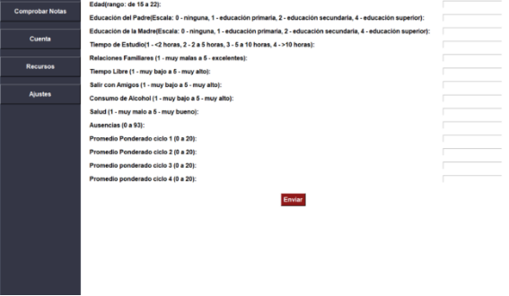
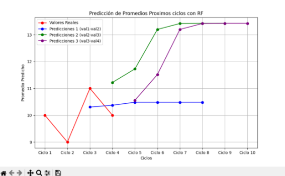

# EstudIA – Predicción de Rendimiento Estudiantil
Este proyecto consiste en el desarrollo de una página web diseñada para ayudar a estudiantes universitarios a predecir su promedio académico del próximo ciclo. La herramienta utiliza un formulario interactivo en el que los usuarios ingresan información personal y de hábitos, como edad, tiempo dedicado al estudio, actividades sociales, salud mental, entre otros factores. A partir de estos datos, un modelo predictivo estima el promedio esperado, proporcionando una visión personalizada que les permite tomar decisiones informadas para mejorar su desempeño académico.

## **Overview**

Este proyecto es una aplicación web diseñada para predecir el promedio futuro de un estudiante universitario. Utiliza un modelo de aprendizaje automático (Random Forest Regressor) entrenado con datos de estudiantes de colegios en Portugal. Los usuarios pueden ingresar información personal, social y académica a través de un formulario para obtener una proyección visualizada del rendimiento hasta el ciclo 10.



## **Proyect Demo**

### **Demostración de nuestro proyecto**

En esta demostración, mostramos cómo los estudiantes pueden utilizar nuestra aplicación web para predecir su rendimiento académico en ciclos futuros. El video ofrece una guía paso a paso sobre cómo ingresar la información requerida en el formulario y cómo se generan las predicciones utilizando el modelo de predicción.

La demostración destaca las siguientes características clave del proyecto:

1. **Ingreso de Datos:** Cómo los usuarios pueden completar detalles sobre su historial académico, hábitos de estudio y atributos personales mediante un formulario fácil de usar.
2. **Predicciones en Tiempo Real:** El proceso de generación de predicciones para promedios futuros basado en los datos ingresados mediante un modelo de regresión Random Forest.
3. **Visualizaciones Interactivas:** 
   - La aplicación genera gráficos dinámicos que ilustran los promedios predichos para los ciclos futuros.
   - Estas visualizaciones ayudan a los estudiantes a entender cómo podría evolucionar su rendimiento académico a lo largo del tiempo.

Al ver la demostración, podrás entender cómo se aplica el aprendizaje automático para predecir el rendimiento académico. El video muestra cómo los estudiantes pueden utilizar esta herramienta para planificar mejor sus estudios y mejorar su rendimiento en futuros ciclos.

## **Key Features**

- **Formulario interactivo:** Captura datos relevantes del estudiante.
- **Predicción personalizada:** Basada en modelos de regresión con alta precisión.
- **Visualización de resultados:** Gráficas interactivas que muestran la evolución proyectada del promedio del estudiante.

## **Dataset**

El modelo fue entrenado con un conjunto de datos público que contiene información sobre el rendimiento de estudiantes de colegios portugueses. Este dataset incluye atributos relacionados con calificaciones, datos demográficos, factores sociales y características escolares.

- **Nombre del dataset:** *Student Performance Dataset*
- **Descripción:**
  Este dataset aborda el logro académico en dos escuelas portuguesas, específicamente en las materias de Matemáticas y Lengua Portuguesa. Los atributos incluyen datos como calificaciones de los tres trimestres (G1, G2, G3), características demográficas (edad, educación de los padres), tiempo de estudio, relaciones familiares y más.

Para más detalles sobre el dataset, puedes consultar el artículo: [Cortez y Silva, 2008](https://archive.ics.uci.edu/ml/datasets/student+performance)

## **Model Training**

Se utilizó un modelo **Random Forest Regressor** para realizar las predicciones. Este modelo fue seleccionado por su capacidad para manejar datos no lineales y su robustez frente a ruido en los datos.

### **Características más importantes en la predicción:**

Basado en el análisis de importancia de las variables, los factores más influyentes fueron:

- **age**: Edad del estudiante.
- **Medu** y **Fedu**: Nivel educativo de la madre y el padre.
- **traveltime**: Tiempo de traslado a la escuela.
- **studytime**: Tiempo de estudio semanal.
- **famrel**: Calidad de las relaciones familiares.
- **freetime**: Tiempo libre disponible.
- **goout**: Frecuencia de salidas con amigos.
- **Walc**: Consumo de alcohol durante los fines de semana.
- **health**: Estado de salud del estudiante.
- **absences**: Cantidad de ausencias escolares.
- **G1** y **G2**: Calificaciones del 1.º y 2.º trimestre.

### **Desempeño del modelo:**

- **Error Cuadrático Medio (MSE):** 0.64
- **Raíz del Error Cuadrático Medio (RMSE):** 0.80
- **Coeficiente de Determinación (R²):** 0.89

Estos resultados indican que el modelo tiene un alto grado de precisión en la predicción de promedios futuros.

## **Process**

1. **Entrada de datos:**
   Los usuarios ingresan información personal, social y académica, incluyendo los promedios de los últimos 4 ciclos cursados.
   
2. **Predicción iterativa:**
   1. El modelo utiliza pares consecutivos de promedios (e.g., ciclos 1 y 2) para predecir el promedio del ciclo siguiente.
   2. Este proceso se repite hasta proyectar el promedio del ciclo 10.
   
3. **Generación de gráficas:**
   1. Se generan hasta 3 gráficas, basadas en diferentes combinaciones de promedios ingresados.
   2. Las gráficas comparan los valores reales proporcionados por el usuario con las predicciones generadas por el modelo.

## **Visualization of Predictions**

Una característica destacada del proyecto es la generación de gráficas para visualizar la evolución del rendimiento académico proyectado hasta el ciclo 10.



A continuación, se muestra un gráfico generado por el modelo de predicción, donde se visualizan los promedios predichos para los próximos ciclos.

**Puntos rojos:** Estos puntos representan los valores de los promedios de los últimos cuatro ciclos académicos, que el usuario ingresa como input en el formulario. Estos valores se utilizan para generar las predicciones para los ciclos futuros.

**Puntos verdes, morados y azules:** Estos puntos representan las predicciones generadas para los ciclos siguientes, utilizando los promedios de los ciclos anteriores. Cada color corresponde a una serie de predicciones basadas en los dos últimos promedios ingresados, con el fin de estimar cómo evolucionará el rendimiento del estudiante en los próximos ciclos.

- **Puntos verdes**: Predicción basada en los promedios del ciclo 1 y 2.
- **Puntos azules**: Predicción basada en los promedios del ciclo 2 y 3.
- **Puntos morados**: Predicción basada en los promedios del ciclo 3 y 4.

De esta manera, el modelo crea hasta tres series de predicciones, lo que ayuda a visualizar cómo podría cambiar el rendimiento académico del estudiante a lo largo de los siguientes ciclos.
## **Proyect Architecture**

1. **Frontend:**
   - HTML, CSS y JavaScript para la interfaz de usuario.
   - Compatible con frameworks como Flask o Streamlit.
   
2. **Backend:**
   - Procesamiento de datos y predicción en Python.
   - Modelo de Machine Learning integrado con scikit-learn.

3. **Visualización:**
   - Gráficas generadas dinámicamente con Matplotlib.

## **Installation**

### **Requisitos**

- Python 3.8 o superior.
- Bibliotecas requeridas (ver requirements.txt).

### **Pasos de instalación**

1. **Clona el repositorio:**

   ```bash
   git clone https://github.com/tu-repositorio/prediccion-academica.git

2. **Navega al directorio del proyecto:**

   ```bash
   cd prediccion-academica  

3. **Instala las dependencias:**

   ```bash
   pip install -r requirements.txt  

4. **Ejecuta la aplicación:**

   ```bash
   python app.py  

5. **Abre el navegador en** http://localhost:5000.

## **Usage**

1. Ingrese los parámetros requeridos en el formulario como la edad, tiempo de estudio, tiempo libre, promedio de ciclos pasados entre otras más.
1. Haga clic en el botón “Predecir” para obtener como resultado las gráficas de predicción a lo largo del tiempo.
1. Analiza las gráficas generadas para evaluar el rendimiento proyectado.

## **Future Improvements**

- Integrar datos adicionales para mejorar la precisión del modelo.
- Desarrollar una API para permitir consultas desde otras aplicaciones.
- Implementar una interfaz más interactiva utilizando gráficos dinámicos.

## **Contributions**

- Cuno Apaza Jhoveran Cristian
- Diaz Martinez Jorge Jhonatan
